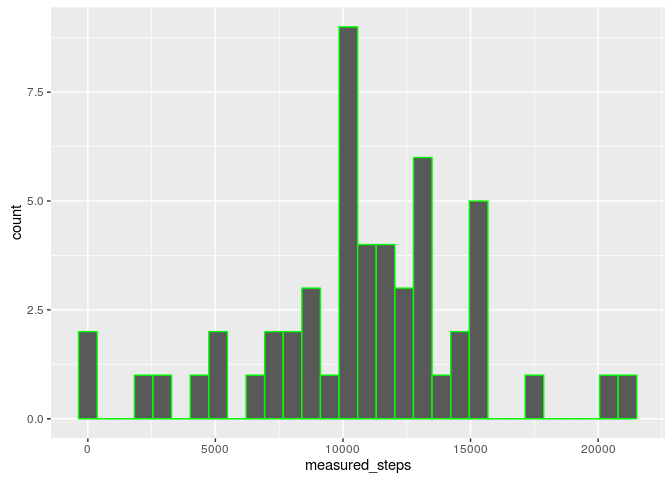
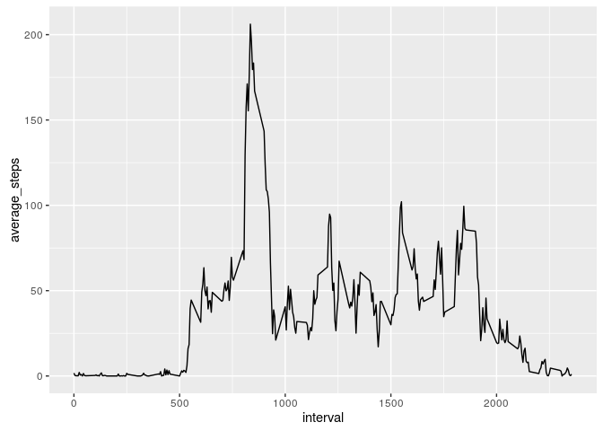
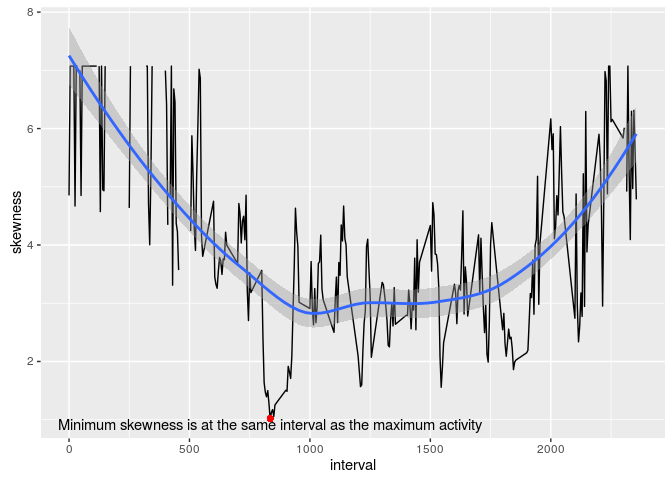
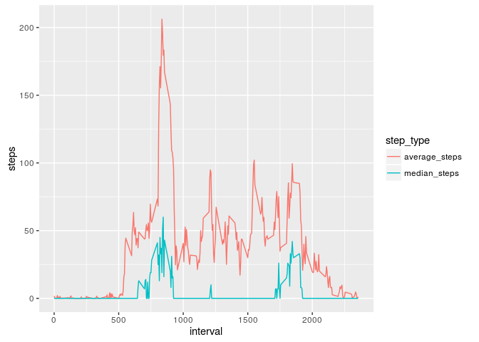
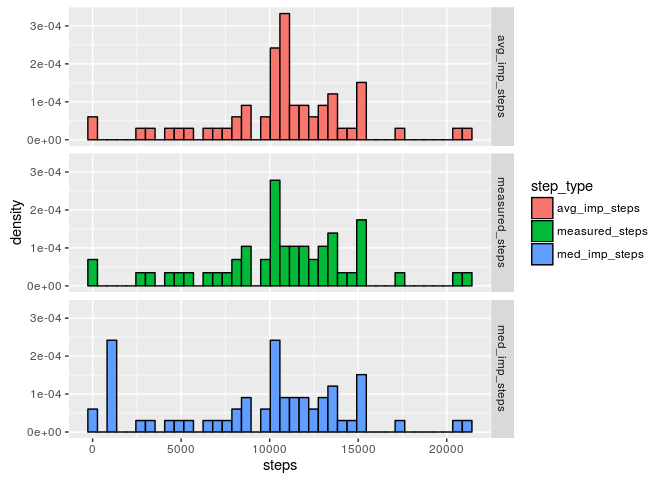
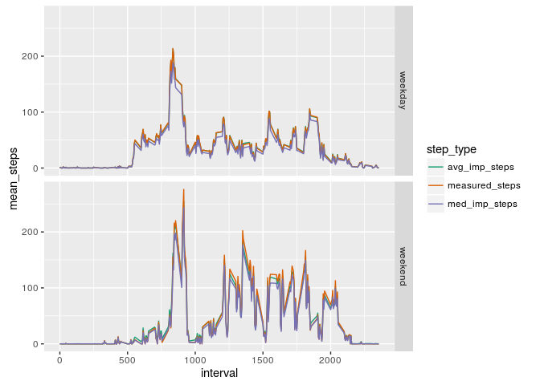

# Reproducible Research: Peer Assessment 1

## Loading and preprocessing the data
##### __*1. Load the data (i.e. read.csv()).*__
In the input data set, "steps" is renamed "measured_steps", to distinguish it from imputed steps created later.


```r
rm(list=ls())
library(dplyr)      # data manipulation
library(tidyr)      # data manipulation
library(ggplot2)    # plotting
library(lubridate)  # date manipulation
library(xtable)     # table printing
library(moments)    # skewness calculation
act <- read.csv(unz("activity.zip","activity.csv"),header=TRUE,
                stringsAsFactors = FALSE)
names(act)[1] <- "measured_steps"
```

##### __*2. Process/transform the data (if necessary) into a format suitable for your analysis.*__
The processing is specific to each question below, and is included with the appropriate question.

## What is mean total number of steps taken per day?
##### __*1. Make a histogram of the total number of steps taken each day.*__
To create a histogram of steps taken each day, first the sums of steps needs to be calculated.  In the code below, na.rm is set to FALSE so there are not a large number of zero step days in the histogram.  This causes a warning of "Removed 8 rows containing non-finite values (stat_bin)." (which has been surpressed) because there are 8 days with only NAs.


```r
act_by_date <-group_by(act,date)
steps_per_day <- summarise(act_by_date, sum(measured_steps, na.rm=FALSE))
names(steps_per_day) <- c("date", "measured_steps")
ggh <- ggplot(steps_per_day,aes(measured_steps))
ggh <- ggh + geom_histogram(bins=30,col="green")
ggh
```

<!-- -->

##### __*2. Calculate and report the mean and median total number of steps taken per day.*__
  The mean and median number of steps per day are calculated below.
  

```r
mean_steps_per_day <- formatC(mean(steps_per_day$measured_steps,
                                     na.rm = TRUE), format="f",
                                big.mark=",", digits=2)
median_steps_per_day <- formatC(median(steps_per_day$measured_steps,
                                         na.rm = TRUE), format="f",
                                  big.mark=",", digits=2)
```

The mean total number of steps taken per day is 10,766.19 and
the median number of steps is 10,765.00

## What is the average daily activity pattern?
##### __*1. Make a time series plot (i.e. type = "l") of the 5-minute interval (x-axis) and the average number of steps taken, averaged across all days (y-axis).*__
Plotting the activity pattern requires averaging over all of the days for each interval.


```r
act_by_interval <- group_by(act, interval)
avg_steps_per_interval <- summarise(act_by_interval,
                                    mean(measured_steps,na.rm=TRUE))
names(avg_steps_per_interval) <- c("interval", "average_steps")
ggt <- ggplot(avg_steps_per_interval, aes(interval, average_steps))
ggt <- ggt + geom_line()
ggt
```

<!-- -->

##### __*2. Which 5-minute interval, on average across all the days in the dataset, contains the maximum number of steps?*__
The most active interval may be computed as follows:


```r
find_max <-avg_steps_per_interval[,2] ==
    max(avg_steps_per_interval[,2],na.rm=TRUE)
max_interval <- unlist(avg_steps_per_interval[find_max,1])
hrs <- max_interval %/% 100
min <- max_interval %% 100
time <- paste0(hrs, ":", min, " AM")
```

The most active interval is 835, or a time of 8:35 AM.

## Imputing missing values
##### __*1. Calculate and report the total number of missing values in the dataset.*__
The first part of this problem is to determine how many NAs there are in the data.


```r
count_na <- sum(is.na(act$measured_steps))
```

There are 2304 NA values in the data set.

##### __*2. Devise a strategy for filling in all of the missing values in the dataset.*__
Next, we need to come up with a strategy for imputing values to the intervals with only NA.  I'm afraid that I nattered along here a lot more than was asked for in the assignment. As there is significant variation in activity with time, it seems desirable to capture this behavior in our imputation.  We shall use a central tendency statistic computed by interval.  Is mean or median more desirable?  Median is more appropriate for highly skewed distributions because the mean is strongly influenced by outliers.  Lets look at the skewness of the interval distributions.


```r
skew_steps_per_interval <- summarise(act_by_interval,
                                     skewness(measured_steps,na.rm=TRUE))
names(skew_steps_per_interval) <- c("interval", "skewness")
min_skew <- min(skew_steps_per_interval[,2],na.rm=TRUE)
find_min_skew <-skew_steps_per_interval[,2] == min_skew
find_min_skew[is.na(find_min_skew)] <-  FALSE
min_interval <- unlist(skew_steps_per_interval[find_min_skew,1])
ggsk <- ggplot(skew_steps_per_interval, aes(interval,skewness))
ggsk <- ggsk + geom_line()
ggsk <- ggsk + geom_smooth()
ggsk <- ggsk + geom_point(x=min_interval,y=min_skew,pch=19,color="red")
ggsk <- ggsk + annotate("text", x=min_interval, y=min_skew, vjust=1,
                        label=paste("Minimum skewness is at the",
                                    "same interval as the maximum activity"))
ggsk
```

<!-- -->

The distributions are fairly highly skewed, but the least skewness is where the largest activity values are.  It still isn't clear to me what is the best approach for value imputation, so we will carry both mean and median for a while to see how much their difference affects the results.

We have already calculated the mean steps per interval. Let's calculate the median steps per interval, and compare the two.


```r
med_steps_per_interval <- summarise(act_by_interval,
                                    median(measured_steps,na.rm=TRUE))
names(med_steps_per_interval) <- c("interval", "median_steps")
steps_per_interval <- left_join(avg_steps_per_interval,med_steps_per_interval)
spi_narrow <- gather(data = steps_per_interval,
                     key = step_type, 
                     value = steps,
                     contains("step"))

ggspi <- ggplot(spi_narrow, aes(x = interval,
                                y = steps,
                                color = step_type))
ggspi <- ggspi + geom_line()
ggspi
```

<!-- -->

Well, it's pretty clear that imputing values from the average step will yield larger values than using median steps, but that doesn't resolve which approach is most appropriate.  I think that I will continue to carry both methods forward.

##### __*3. Create a new dataset that is equal to the original dataset but with the missing data filled in.*__
Now we will create the imputed values.  I did it a little differently than was requested, as I kept the original data, and added the imputed data into the same data table.  The code below takes the following approach:

1. Match the median and mean steps per interval with the base data set, and create mean and median columns.
2. Create average imputed steps and median imputed steps variables by replacing the NA values with the computed averages.
3. Remove the median and mean variables, as they are no longer needed


```r
interval_index <- match(act$interval,steps_per_interval$interval)
act$median_steps <- unlist(steps_per_interval[interval_index,"median_steps"])
act$average_steps <- unlist(steps_per_interval[interval_index,"average_steps"])
na_filter <- is.na(act$measured_steps)
act$med_imp_steps <- act$measured_steps
act$med_imp_steps[na_filter] <- act$median_steps[na_filter]
act$avg_imp_steps <- act$measured_steps
act$avg_imp_steps[na_filter] <- act$average_steps[na_filter]
act <- select(act,-median_steps, -average_steps)
```

##### __*4. Make a histogram of the total number of steps taken each day. Calculate and report the mean and median total number of steps taken per day. Do these values differ from the estimates from the first part of the assignment? What is the impact of imputing missing data on the estimates of the total daily number of steps?*__
Next we create a faceted histogram to compare the measured steps with the two different imputed steps.


```r
act_narrow <- gather(act, key=step_type, value=steps, contains("step"))
act_nar_date_type <- group_by(act_narrow, date, step_type)
act_nar_date_type_sum <- summarise(act_nar_date_type, sum(steps, na.rm=FALSE))
names(act_nar_date_type_sum)[3] <- "steps"
ggp <- ggplot(act_nar_date_type_sum, aes(x = steps,
                                         y = ..density..,
                                         fill=step_type))
ggp <- ggp + geom_histogram(color="black",
                            bins=40)
ggp <- ggp + facet_grid(step_type ~ . )
ggp
```

<!-- -->

The two imputation methods clearly give different results.  Note the extra hump in the average imputed steps around interval 10,800.  Also note the extra hump in the median imputed steps around interval 1400.  Let's build a table to compare the mean and median values using both imputation methods.


```r
act_nar_dts_by_step_type <- group_by(act_nar_date_type_sum,step_type)
act_nar_dts_median <- summarize(act_nar_dts_by_step_type,
                                median(steps, na.rm=TRUE))
act_nar_dts_mean <- summarize(act_nar_dts_by_step_type,
                                mean(steps, na.rm=TRUE))
comp_imp_methods <- left_join(act_nar_dts_median,act_nar_dts_mean)
names(comp_imp_methods) <- c("step_type", "median", "mean")
comp_imp_mthd_fmt <- comp_imp_methods
comp_imp_mthd_fmt[,2] <- formatC(unlist(comp_imp_methods[,2]), format="f",
                                   digits=2,big.mark=",")
comp_imp_mthd_fmt[,3] <- formatC(unlist(comp_imp_methods[,3]), format="f",
                                   digits=2,big.mark=",")
xt <- xtable(comp_imp_mthd_fmt, align=c("c","c","r","r"))
print(xt,type="html")
```

<!-- html table generated in R 3.3.1 by xtable 1.8-2 package -->
<!-- Mon Sep 26 12:50:55 2016 -->
<table border=1>
<tr> <th>  </th> <th> step_type </th> <th> median </th> <th> mean </th>  </tr>
  <tr> <td align="center"> 1 </td> <td align="center"> avg_imp_steps </td> <td align="right"> 10,766.19 </td> <td align="right"> 10,766.19 </td> </tr>
  <tr> <td align="center"> 2 </td> <td align="center"> measured_steps </td> <td align="right"> 10,765.00 </td> <td align="right"> 10,766.19 </td> </tr>
  <tr> <td align="center"> 3 </td> <td align="center"> med_imp_steps </td> <td align="right"> 10,395.00 </td> <td align="right"> 9,503.87 </td> </tr>
   </table>

As expected, the median imputation method gives a smaller result.  As shown in the histogram, the character of the distribution for both of the imputed methods was somewhat different from the measured data.  I tend to be uncomfortable with both imputation methods, and prefer just leaving out the NA data.

## Are there differences in activity patterns between weekdays and weekends?
##### __*1. Create a new factor variable in the dataset with two levels – “weekday” and “weekend” indicating whether a given date is a weekday or weekend day.*__
For this problem we will add a character column giving the day of the week and a factor column classifying the day as either weekday or weekend.  These columns will be added to the data frame which has the measured steps, as well as both types of imputed steps.


```r
act$day_of_week <- weekdays(ymd(act$date))
act$weekdays <- factor("weekday", levels = c("weekday", "weekend"))
weekend_filter <- act$day_of_week == "Saturday" |
    act$day_of_week == "Sumday"
act$weekdays[weekend_filter] <- factor("weekend",
                                       levels = c("weekday", "weekend"))
```

##### __*2. Make a panel plot containing a time series plot (i.e. type = "l") of the 5-minute interval (x-axis) and the average number of steps taken, averaged across all weekday days or weekend days (y-axis).*__
Next we will create a faceted time series line plot comparing the results of the measured steps with both imputations methods for both weekdays and weekends.


```r
act_nar <- gather(act, key=step_type, value=steps, contains("step"))
act_nar_by_int_stype <- group_by(act_nar,interval,step_type,weekdays)
act_nar_int_stype_avg <- summarize(act_nar_by_int_stype,
                                   mean(steps, na.rm=TRUE))
names(act_nar_int_stype_avg) <- c("interval", "step_type", "weekdays",
                                  "mean_steps")
ggts <- ggplot(act_nar_int_stype_avg, aes(x = interval,
                                         y = mean_steps,
                                         color=step_type))
ggts <- ggts + geom_line()
ggts <- ggts + facet_grid(weekdays ~ .)
ggts <- ggts + scale_colour_brewer(palette = "Dark2")
ggts
```

<!-- -->

The subject is clearly more active on the weekends, and the two imputation methods don't impact the results a great deal.  Also, he works out very consistently at 8:30 in the morning.  He must be a banker with those kind of hours.

